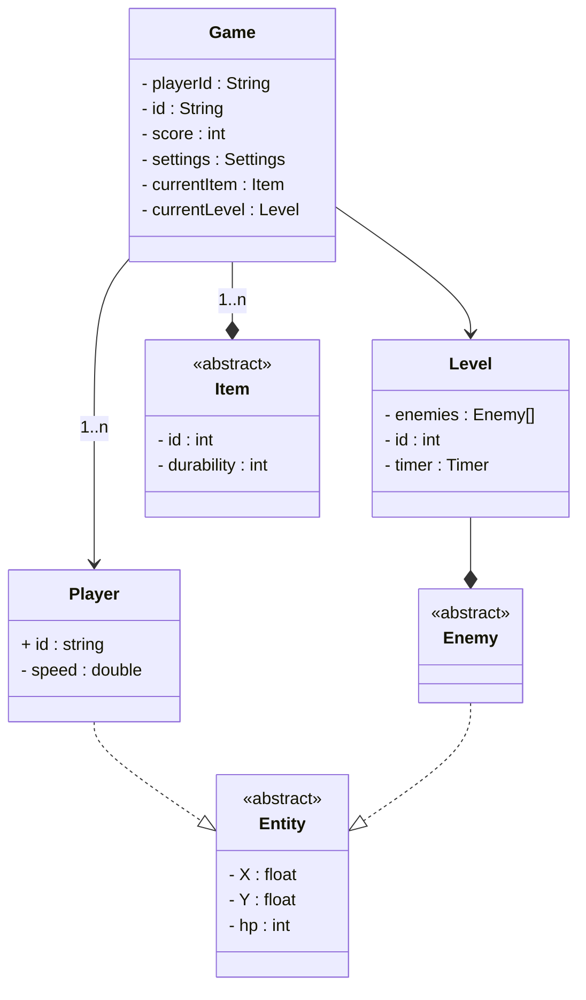

# Backend per el projecte de DSA

## To-Do

[x] Web Registre. (2,5 hores per Wenjie)

[] Web Login.

[] Android App Registre.

[] Android App Login.

## Esquema

```mermaid
classDiagram


class Entity{
<<abstract>>
- X : float
- Y : float
- hp : int
}

class Player{
+ id : string
- speed : double
}

class Enemy{
<<abstract>>
}

Player ..|> Entity
Enemy ..|> Entity


class Game{
- playerId : String
- id : String
- score : int
- settings : Settings
- currentItem : Item
- currentLevel : Level
}

class Level{
- enemies : Enemy[]
- id : int
- timer : Timer

}

class Item{
<<abstract>>
- id : int
- durability : int
}

Game --> Player : 1..n
Level --* Enemy
Game --* Item : 1..n
Game --> Level
```